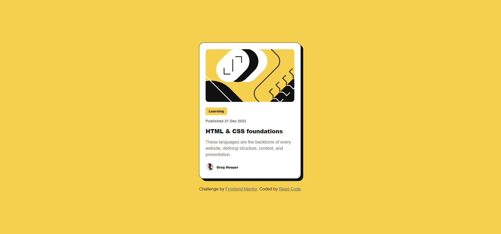

# Frontend Mentor - Blog preview card solution

This is a solution to the [Blog preview card challenge on Frontend Mentor](https://www.frontendmentor.io/challenges/blog-preview-card-ckPaj01IcS). Frontend Mentor challenges help you improve your coding skills by building realistic projects. 

## Table of contents

  - [The challenge](#the-challenge)
  - [Screenshot](#screenshot)
  - [Links](#links)
- [My process](#my-process)
  - [Built with](#built-with)
  - [What I learned](#what-i-learned)
- [Author](#author)

### The challenge

Users should be able to:

- See hover and focus states for all interactive elements on the page

### Screenshot

### Links

- Solution URL: [Add solution URL here](https://your-solution-url.com)
- Live Site URL: [Add live site URL here](https://your-live-site-url.com)

## My process
- I first sketched the layout of the work
- using html semantics I designed the layout skeleton and subsequently use css flexbox to arrange and design the work
- using css variables, I styled the colors, borders, box-shadows, etc

### Built with

- Semantic HTML5 markup
- CSS custom properties
- Flexbox
- CSS variables

### What I learned

In this challenge, I learned how to create CSS variables which made my work more readable, clean, and reusable.

## Author

- Frontend Mentor - [@hsfarid](https://www.frontendmentor.io/profile/hsfarid)
- Twitter - [@reed_code](https://www.twitter.com/reed_code)
